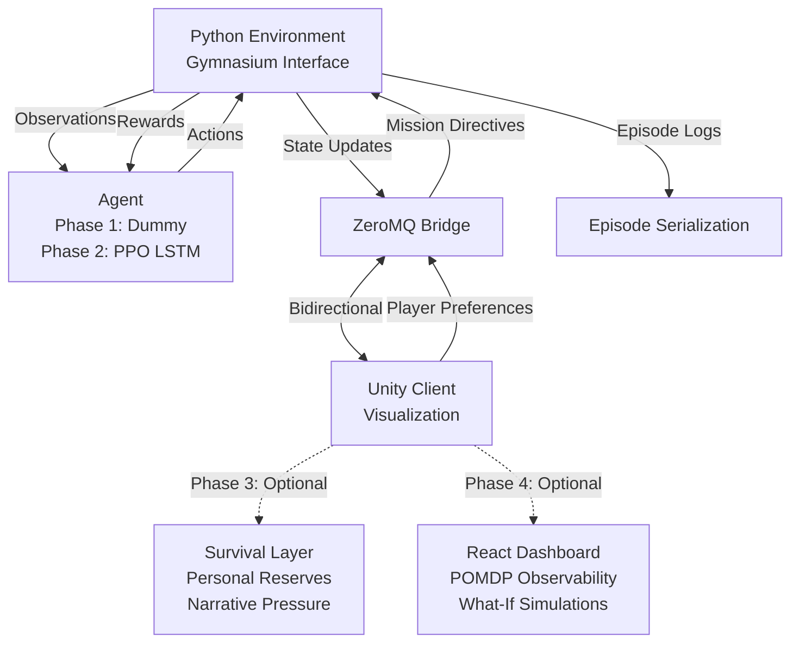

# Silent Sky MVP Implementation Plan

## Development Phases

**Phase 1: Unity + Dummy Agent (MVP)**

- Unity visualization and UI (sector map, events, financial tracking)
- Dummy Python agent (simple heuristic: greedy, round-robin, or random)
- ZeroMQ bridge working
- Full game loop: pre-episode → during → post-episode
- Currency system functional
- Upgrade shop UI (upgrades can be placeholders initially)
- Episode serialization
- **Goal**: Get gameplay feel right, validate mechanics, test communication

**Phase 2: Real RL Agent**

- Replace dummy agent with PPO (Stable-Baselines3)
- Pattern learning system
- Real training pipeline
- Fine-tuning with player preferences
- LSTM policy for POMDP

**Phase 3: Survival/Sustenance Layer (Optional - After Core Loop is Fun)**

- Thin, abstract survival mechanic: Player character lives on satellite
- **Personal Reserves**: Single abstract variable (0-100) representing food, oxygen, medical, psychological endurance
- **Key constraints**:
- NO hunger bars, meters, or micromanagement
- Changes ONLY at episode boundaries (not per-step)
- Tied to observatory performance (discoveries → resupply, failures → ration cuts)
- Strategic, not tactical
- Does NOT affect RL agent (no new state/actions/rewards)
- Failure is rare and narrative (one final episode when reserves hit zero)
- Adds emotional weight and narrative coherence without complexity
- **Timing**: Add ONLY after Phase 1 & 2 are stable and fun

**Phase 4: Observability & Analysis (Optional)**

- React dashboard OR enhanced Unity UI for:
- POMDP observability: Visualize what we know about the POMDP (belief states, uncertainty distributions)
- Replay observed events: Review what the agent actually saw vs. ground truth
- What-if policy simulations: Test different policies on same episode, compare strategies
- Deep introspection tools for understanding agent behavior

## Architecture Overview

**IMPORTANT: Architecture has changed to Unity ML-Agents**

The MVP implements a space observatory POMDP where:

- **Unity** is the authoritative environment (ML-Agents)
- **Python** connects via ML-Agents Gym interface for training only
- **ML-Agents** handles communication automatically (replaces ZeroMQ)
- **Phase 1**: Foundation in Unity (world model, visualization)
- **Phase 2**: ML-Agents integration + Python training (Stable-Baselines3 PPO with recurrent policies)

**See `docs/ARCHITECTURE.md` for current architecture details.**



## Project Structure

```javascript
silent-sky/
├── python/
│   ├── silent_sky/
│   │   ├── __init__.py
│   │   ├── env/
│   │   │   ├── __init__.py
│   │   │   ├── observatory_env.py      # Main Gym environment
│   │   │   ├── state.py                 # Environment state
│   │   │   ├── events.py                # Event generation (3 types)
│   │   │   ├── sensors.py               # Wide-field sensor with noise
│   │   │   ├── rewards.py               # Currency-based reward system
│   │   │   └── upgrades.py              # Upgrade system and effects
│   │   ├── agent/
│   │   │   ├── __init__.py
│   │   │   ├── dummy_agent.py          # Phase 1: Simple heuristic agent
│   │   │   └── ppo_trainer.py           # Phase 2: PPO training wrapper
│   │   ├── bridge/
│   │   │   ├── __init__.py
│   │   │   └── zmq_bridge.py            # Python-Unity communication
│   │   └── utils/
│   │       ├── __init__.py
│   │       ├── logging.py               # Episode serialization
│   │       └── config.py                # Configuration management
│   ├── requirements.txt
│   ├── setup.py
│   └── train.py                         # Training entry point
├── unity/
│   ├── Assets/
│   │   ├── Scripts/
│   │   │   ├── Bridge/
│   │   │   │   └── ZMQBridge.cs        # Unity-side communication
│   │   │   ├── Visualization/
│   │   │   │   ├── SectorMap.cs        # 8-sector sky map
│   │   │   │   ├── EventVisualizer.cs  # Event display
│   │   │   │   ├── AgentStateUI.cs     # Agent state display
│   │   │   │   └── UncertaintyDisplay.cs # Uncertainty visualization
│   │   │   ├── Playback/
│   │   │   │   └── EpisodePlayer.cs    # Episode replay
│   │   │   ├── Mission/
│   │   │   │   └── AgentSwapToggle.cs # Switch dummy ↔ PPO agent
│   │   │   │   ├── MissionDirectives.cs # Player preference input
│   │   │   │   └── UpgradeShop.cs      # Upgrade purchase UI
│   │   │   │   # EmergencyOverride.cs - DEFERRED to Phase 2
│   │   │   └── Finance/
│   │   │       └── BudgetUI.cs         # Budget and financial tracking
│   │   └── Scenes/
│   │       └── ObservatoryScene.unity
│   └── Packages/
├── data/
│   └── episodes/                        # Serialized episodes
├── .gitignore
└── README.md
```


## Implementation Details

### 1. Python Environment (`python/silent_sky/env/`)

**observatory_env.py** - Main Gymnasium environment:

- Inherits from `gymnasium.Env` (Gymnasium is the maintained fork of Gym)
- 8 discrete sky sectors (0-7)
- **Discrete action space**: `gym.spaces.Dict` with:
- `sector`: Discrete(8) - which sector to observe
- `exposure_mode`: Discrete(3) - SHORT (0), MEDIUM (1), LONG (2)
- *Note: Can be flattened to Discrete(24) = 8 sectors × 3 modes*
- **Simplified observation space** (NO belief state leakage): `gym.spaces.Dict` with:
- `sensor_readings`: Box(0.0, 1.0, (8,)) - noisy sensor data per sector
- `sensor_confidence`: Box(0.0, 1.0, (8,)) - sensor noise metadata per sector (NOT belief state)
- **CRITICAL**: Must be sensor uncertainty only, computed before agent acts
- Independent of history aggregation
- Renamed from "uncertainty" to avoid belief state confusion
- Represents "how noisy the measurement was", not "what the agent believes"
- `time_remaining`: Box(0.0, 1.0, (1,)) - normalized time in orbital cycle
- `budget_remaining`: Box(0.0, 1.0, (1,)) - normalized budget remaining
- **REMOVED** (belief state leakage):
    - ❌ `event_history` - LSTM should learn this internally
    - ❌ `sector_activity_estimates` - Agent should infer, not receive
    - ❌ `prediction_hints` - Save for upgrade outputs later (not observations)
    - ❌ `last_action` - LSTM can maintain this in hidden state
- Episodes: Fixed horizon (one orbital cycle, e.g., 100 steps)
- Deterministic seeding support

**state.py** - Environment state:

- Ground truth: sector states, event occurrences, timestamps, event values
- Agent-visible: only noisy observations (never ground truth)
- Episode metadata: timestep, cycle progress
- **Financial state**: Current budget, total earnings, total costs, upgrade effects
- **Upgrade state**: Active upgrades and their parameters (sensor quality, prediction accuracy, etc.)

**events.py** - Event system (simplified for Phase 1, scaffolded for Phase 2):

- 3 event types:
- `NOISE`: Background noise (frequent, low value, creates false positives)
- `MINOR_TRANSIENT`: Minor event (moderate frequency, medium value, moderate duration)
- `MAJOR_TRANSIENT`: Major event (rare, high value, short duration - creates urgency)
- **Phase 1: Minimal Pattern System** (keep it simple):
- **Sector activity rates**: Each episode has hidden "pattern seed" → determines which sectors are "hot" vs "cold"
    - Some sectors are "hot" (high event rate), others "cold" (low event rate)
    - Pattern: Agent can learn which sectors are active THIS episode
    - Variation: Which sectors are hot changes between episodes
- **Simple event decay**: Events decay if unobserved (time pressure)
- **Base randomness**: Even "hot" sectors have stochastic timing (irreducible uncertainty)
- **That's it for Phase 1** - if it's not fun with just hot/cold sectors, complexity won't help
- **Phase 2: Additional Patterns** (scaffold code, but disable initially):
- **Temporal clustering**: Events cluster in time windows (DEFERRED - can scaffold but disable)
- **Spatial correlations**: Active sectors near other active sectors (DEFERRED - can scaffold but disable)
- **Event type dependencies**: Minor events precede major events (DEFERRED - can scaffold but disable)
- **Partial hints**: Events emit ambiguous signals to adjacent sectors (DEFERRED - can scaffold but disable)
- **Rationale**: Debugging event system + gameplay tuning + Unity sync is hard enough. Start simple.
- **Agent Learning Mechanism**:
- Agent observes noisy signals and learns episode-specific patterns through RL
- LSTM policy maintains hidden state to track:
    - Which sectors have been active (learned activity rates)
    - Temporal patterns (recent event history)
    - Spatial patterns (correlations between sectors)
- Agent adapts strategy mid-episode as it learns patterns
- Patterns are learnable but never fully deterministic
- **Upgrade Integration**:
- Prediction upgrades reveal partial pattern information:
    - "Sector activity forecast": Shows which sectors are likely hot (with uncertainty)
    - "Temporal predictions": Warns when major events are likely (with uncertainty)
- Upgrades reduce but never eliminate uncertainty
- **Event Generation Process**:

1. Episode starts: Generate pattern seed → determine sector activity rates, correlations
2. Each timestep: Calculate event probabilities based on:

    - Base sector activity (from pattern seed)
    - Temporal clustering (recent events increase probability)
    - Spatial correlations (nearby active sectors increase probability)
    - Event dependencies (minor events increase major event probability)
    - Base randomness (irreducible uncertainty)

1. Generate events probabilistically
2. Events decay if unobserved (time pressure)

- Events can be missed if not observed (core gameplay mechanic)
- **Partial hints**: Events emit ambiguous signals to nearby sectors (creates tension: "something in sector 3 or 4?")
- **Post-episode reveal**: Full ground truth shown after episode ends, including pattern seed (creates "what if" moments and learning opportunities)

**sensors.py** - Wide-field sensor:

- Single sensor with configurable field of view
- **Noisy readings**: Gaussian noise on true signal (creates uncertainty)
- **Uncertainty increases with distance**: Observing sector 0 gives clear data for 0, ambiguous for 1-2, very noisy for 3-7
- **Exposure time tradeoff**: Short exposure = quick but noisy; long exposure = precise but slow (resource constraint)
- **Partial field of view**: Can observe primary sector + adjacent sectors with reduced quality (enables strategic positioning)
- Sensor quality improves over time (learning curve, but not too fast - maintain challenge)

**rewards.py** - Multi-component reward (separated from money):

- **CRITICAL RULE**: RL reward ≠ money directly. Agent never sees money in observations.
- **Reward components** (map to economic outcomes but are not money):
- `discovery_value`: Based on event type and quality of observation
    - Major events: High reward value
    - Minor events: Medium reward value
    - Noise: Negative reward (false positive cost)
- `operational_cost`: Based on actions taken
    - Base observation cost
    - Exposure mode cost (SHORT < MEDIUM < LONG)
    - Sector switching cost
- `efficiency_bonus`: Small bonus for optimal resource usage
- `information_gain`: Small bonus for reducing uncertainty
- **Phase 1 (Dummy Agent)**: Net reward = discovery_value - operational_cost (simple for validation)
- **Phase 2 (Initial RL Training)**: Net reward = discovery_value - operational_cost
- **Start with just these two** - let agent learn "find valuable things cheaply"
- efficiency_bonus and information_gain **disabled initially**
- Add them later only if behavior is degenerate
- Rationale: These can dominate early training, create weird policies, make reward tuning painful
- **Phase 2 (Later)**: Net reward = discovery_value - operational_cost + efficiency_bonus + information_gain
- Add bonuses only after base behavior is stable
- **Money calculation** (separate from reward, displayed to player):
- Money = f(rewards, upgrades, player decisions)
- Player sees money, agent never does
- Configurable weights (player-adjustable via mission directives):
- Risk tolerance: Higher = willing to spend more on uncertain sectors
- Exploration bias: Higher = more willing to explore high-uncertainty areas
- Efficiency focus: Higher = prioritize low-cost, high-coverage strategies

### 2. Agent System (`python/silent_sky/agent/`)

**dummy_agent.py** (Phase 1 - MVP):

- Simple heuristic agent for initial development and gameplay validation
- Options:
- **Greedy**: Observe sector with highest uncertainty or detected event signal
- **Round-robin**: Cycle through sectors systematically
- **Hybrid**: Greedy when events detected, round-robin otherwise
- Exposure mode selection:
- Based on uncertainty level (high uncertainty → LONG, low → SHORT)
- Or fixed mode (e.g., always MEDIUM)
- Or random for testing
- Validates game loop, communication, and mechanics before RL complexity
- Can be swapped out for real RL agent in Phase 2

**ppo_trainer.py** (Phase 2):

- Wraps Stable-Baselines3 PPO
- **LSTM policy network** (recurrent for POMDP and pattern learning):
- LSTM hidden state maintains episode-specific pattern memory
- **MUST learn internally**: sector activity rates, temporal clustering, spatial correlations
- **Never receives**: pre-computed belief state (event_history, activity_estimates, etc.)
- Adapts strategy mid-episode as patterns become clearer
- Never receives ground truth patterns (only noisy observations)
- **This is the core POMDP challenge**: Agent builds its own belief state
- **Pattern Learning Mechanism**:
- Agent learns to recognize episode-specific patterns through experience
- LSTM state encodes learned estimates of sector activity, event timing, correlations
- Policy optimizes for: discovering patterns quickly, exploiting learned patterns, adapting to new episodes
- Training across diverse episodes teaches general pattern recognition, not memorization
- **Non-Repetitiveness**:
- Each episode uses different pattern seed (procedural generation)
- Agent must learn patterns each episode, not rely on memorized strategies
- Training curriculum: Gradually increase pattern complexity and variation
- Ensures agent develops generalizable pattern recognition, not episode-specific memorization
- Episode-based training (train between episodes)
- Supports fine-tuning with player preferences
- Saves checkpoints and training metrics
- **Pretraining**: Base policy pretrained on diverse pattern seeds for general competence

**train.py** - Entry point:

- Headless training mode
- Optional Unity connection for live visualization
- Episode serialization for offline analysis
- Deterministic training with seed control

### 3. Python-Unity Bridge (`python/silent_sky/bridge/`)

**zmq_bridge.py**:

- ZeroMQ PUB/SUB for Python → Unity (state updates)
- ZeroMQ REQ/REP for Unity → Python (mission directives)
- Message format: JSON-serialized state snapshots with version field
  ```json
      {
        "schema_version": 1,
        "timestep": 42,
        "state": {...}
      }
  ```


- **CRITICAL**: Python ticks the clock, Unity is passive renderer
- Python: Advances timestep, emits state snapshots, owns episode lifecycle
- Unity: Never the time authority, just displays what Python sends
- Handles connection lifecycle and reconnection

### 4. Unity Client (`unity/Assets/Scripts/`)

**ZMQBridge.cs**:

- Connects to Python ZeroMQ endpoints
- Deserializes state updates
- Sends player preferences back to Python

**SectorMap.cs**:

- Visualizes 8 sectors (circular or grid layout)
- Shows current observations, uncertainty, events
- Color-coded by uncertainty level

**EventVisualizer.cs**:

- Displays detected events (with uncertainty) during episode
- **Shows partial hints**: Ambiguous signals from nearby sectors (creates tension)
- **Post-episode reveal**: Shows all missed events with full details (creates "what if" moments)
- Timeline visualization with event decay
- **Efficiency metrics**: Coverage percentage, events found vs missed, resource usage

**AgentStateUI.cs**:

- Current action, sensor readings, time remaining
- **Resource meter**: Shows remaining resources (creates constraint awareness)
- **Reward components breakdown**: Stub visually first (don't over-polish UI early)
- **Tradeoff indicators**: Stub visually first (don't over-polish UI early)
- **Note**: Efficiency breakdowns, tradeoff indicators, reward component charts - stub them visually first, polish later

**UncertaintyDisplay.cs**:

- Visual representation of uncertainty per sector
- Fog/opacity effects for high uncertainty

**EpisodePlayer.cs**:

- Loads serialized episodes
- **Minimal viable playback** (Phase 1):
- Step forward
- Step backward
- Jump to timestep
- No fancy overlays at first (playback systems often double dev time)
- Side-by-side comparison mode (deferred)

**AgentSwapToggle.cs** (NEW - Critical for debugging):

- Button or config to switch between:
- Dummy agent
- Trained PPO agent
- Same episode seed for comparison
- Invaluable for: Debugging, demos, sanity checks
- Small but powerful feature

**MissionDirectives.cs**:

- UI for player preferences (set before/during episode):
- Risk tolerance slider (affects agent's willingness to spend on uncertain sectors)
- Exploration vs exploitation bias (affects agent's sector selection)
- Efficiency focus (affects agent's exposure time and switching behavior)
- Budget limit (hard cap on spending per episode)
- Priority markers (mark specific sectors as high priority)
- Sends directives to Python via bridge
- **CRITICAL RULE** (must be enforced in code structure):
- Mission directives modify reward weights ONLY
- **NEVER** modify observations or actions
- Good pattern: `reward = base_reward * preference_weights`
- Bad pattern (do not allow): Changing action availability, revealing hidden info, biasing sensor outputs
- This preserves RL integrity

**UpgradeShop.cs**:

- UI for purchasing upgrades between episodes (Phase 1: simplified):
- **4 binary upgrades** (on/off, no tiers):
- **Sensor Quality**: Reduce noise, improve signal quality (placeholder cost: $500)
- **Field of View**: Observe adjacent sectors with reduced quality loss (placeholder cost: $500)
- **Reaction Speed**: Faster sector switching, reduced switching cost (placeholder cost: $500)
- **Prediction Hints**: Basic pattern hints (shows "hot sector" probability with uncertainty) (placeholder cost: $1000)
- **Effects** (simple multipliers/flags):
- Sensor Quality: Reduce noise by 20%
- Field of View: Observe adjacent sectors with 50% quality
- Reaction Speed: Reduce switching cost by 30%
- Prediction Hints: Show sector activity probability (as upgrade output, NOT observation)
- Shows current budget, upgrade costs, and upgrade effects
- Sends upgrade purchases to Python via bridge
- **Note**: Detailed tiers and costs deferred. Focus on gameplay loop first.

**EmergencyOverride.cs** - **DEFERRED to Phase 2**:

- **Removed from Phase 1** - adds complexity to agent-player contract
- **Replaced with**:
- Priority sector markers (set before/during episode)
- Budget caps (hard spending limits)
- Risk tolerance adjustments (affects agent behavior)
- Can be added after RL agent is working and we understand what we're interrupting

### 5. Instrumentation (`python/silent_sky/utils/`)

**logging.py**:

- Episode serialization (JSON or pickle)
- Includes: full state history, actions, observations, rewards
- Deterministic replay support

**config.py**:

- YAML-based configuration
- Environment parameters, training hyperparameters, Unity connection settings

## Gameplay-First Design Principles

**Core Fantasy**: Operating under uncertainty, making meaningful tradeoffs, feeling the weight of missed opportunities.**Currency System** (core gameplay mechanic):

- **Operational costs**: Each observation costs money (base cost + exposure time multiplier)
- **Sector switching costs**: Changing targets has operational overhead
- **Revenue**: Discoveries earn money based on event type and observation quality
- Major events: High value (e.g., $1000-5000)
- Minor events: Medium value (e.g., $200-800)
- Noise: Low value or negative (false positives cost money to verify)
- **Upgrades**: Spend money between episodes to improve capabilities
- Sensor upgrades: Better precision, wider field of view, lower noise
- Prediction systems: Better event probability forecasts
- Reaction speed: Faster sector switching, shorter exposure minimums
- Data processing: Better uncertainty reduction, faster analysis
- **Budget management**: Player must balance spending on operations vs. upgrades

**Tradeoff Mechanics** (layered constraints):

- **Time pressure**: Fixed orbital cycle (100 steps). Events decay if unobserved. Major events are time-limited.
- **Financial constraints**: Limited budget per episode. Poor decisions = less money for upgrades.
- **Uncertainty cost**: Better information requires more time/resources/money. Quick scans are cheap but noisy; deep observations are expensive but precise.

**Player vs Agent Responsibilities**:**PLAYER (Strategic Director)**:

- **Between episodes**:
- Manage budget: Review earnings, plan spending
- Purchase upgrades: Choose which capabilities to improve
- Set mission directives: Reward weights, risk tolerance, exploration bias
- Review past episodes: Learn patterns, identify missed opportunities
- **During episodes** (limited tactical control):
- **Priority markers**: Mark sectors as "high priority" (agent weights these higher)
- **Budget caps**: Set hard spending limits to prevent bankruptcy
- **Risk tolerance adjustments**: Modify agent behavior mid-episode
- **Emergency override**: DEFERRED to Phase 2 (complicates agent-player contract)
- **After episodes**:
- Review financial performance: Profit/loss, ROI on upgrades
- Analyze missed opportunities: What could have been found with better upgrades?
- Plan next upgrade path: What capabilities are most needed?

**AGENT (Autonomous Observer)**:

- **Tactical execution**: Decides which sector to observe, exposure time, when to switch
- **Autonomous operation**: Runs observation plan based on:
- Current sensor readings and uncertainty
- Mission directives (player preferences)
- Learned patterns from training
- Budget constraints (if player sets limits)
- **Adaptive behavior**: Responds to partial hints, adjusts strategy based on observations
- **No direct control**: Player cannot micromanage individual actions (except emergency override)

**Player Satisfaction**:

- **Financial success feels rewarding**: Profitable episodes, smart upgrade investments
- **Strategic planning pays off**: Right upgrades at right time = better discoveries
- **Partial hints create tension**: Ambiguous signals during episode (e.g., "something interesting in sector 3, but what?")
- **Post-episode reveals create "what if" moments**: See what was missed, calculate potential earnings
- **Progression feels meaningful**: Upgrades unlock new strategies and capabilities

**Gameplay Loop**:

1. **Pre-episode**: Review budget, purchase upgrades, set mission directives
2. **During episode**: Watch agent operate, use emergency overrides if needed, monitor budget
3. **Post-episode**: Review financial performance, see missed opportunities, analyze efficiency
4. **Strategic planning**: Decide next upgrade path based on what you learned
5. **Iterate**: Each episode builds on previous investments and learnings

## Key Design Decisions

1. **Game-first, not RL-first**: Every mechanic serves gameplay feel, not just RL correctness
2. **POMDP enforcement**: Agent never receives ground truth; all observations are noisy
3. **Layered constraints**: Time + resources + uncertainty create meaningful tradeoffs
4. **Efficiency rewards**: Player satisfaction comes from smart resource management
5. **Partial observability with hints**: Ambiguous signals during episode, full reveal after
6. **Determinism**: Full seeding support for reproducibility and replay
7. **Separation**: Python owns logic; Unity owns visualization
8. **Discrete actions**: Discrete sector choice + discrete exposure mode (SHORT/MEDIUM/LONG)
9. **Episode-based training**: Train between episodes, not frame-by-frame
10. **Player influence**: Mission directives affect reward weights, not action space
11. **Learnable but non-repetitive patterns**: 

    - Events follow procedural patterns (sector activity, temporal clustering, spatial correlations)
    - Patterns vary between episodes (procedural generation with pattern seeds)
    - Agent learns patterns through RL (LSTM maintains pattern memory)
    - Patterns are learnable but never fully deterministic (irreducible uncertainty)
    - Agent develops generalizable pattern recognition, not memorization

## Phase 1 MVP Scope (Unity + Dummy Agent)

**Included (minimal but fully playable):**

- 8 sectors, 3 event types, 1 sensor
- **Layered constraints**: Time pressure + resource limits + uncertainty
- **Partial hints + post-episode reveals**: Core gameplay mechanic
- Basic Unity visualization (sector map, events, uncertainty, efficiency metrics)
- Live visualization + episode playback
- Episode serialization
- **Dummy agent** (simple heuristic: greedy, round-robin, or hybrid)
- **Mission directive UI**: Adjust preferences (can affect dummy agent behavior)
- **Upgrade shop UI**: Purchase upgrades between episodes (3-4 binary upgrades, placeholder costs)
- **Priority markers**: Mark sectors as high priority (replaces emergency override)
- Currency system and financial tracking
- Basic pattern system (sector activity rates ONLY, simple event decay)
- **Phase 1**: Just hot vs cold sectors
- Temporal clustering, spatial correlations, event dependencies DEFERRED to Phase 2
- Scaffold code to support them later, but disable initially
- ZeroMQ bridge for Python-Unity communication
- Full game loop: pre-episode → during → post-episode

**Excluded from Phase 1:**

- Real RL agent (PPO, LSTM, training pipeline)
- Complex pattern learning
- Advanced reward shaping

**Phase 1 Success Criteria:**

- Game loop is fun and engaging with dummy agent
- Financial system creates meaningful stakes: Profit/loss matters, upgrades feel impactful
- Player can watch agent and feel tension from tradeoffs (time, money, uncertainty)
- Post-episode review creates "what if" moments (missed earnings, upgrade ROI)
- Adjusting mission directives meaningfully changes agent behavior (even if simple)
- UI/UX feels polished and responsive
- Communication bridge is stable
- Player can understand and influence agent behavior
- **Agent never receives pre-computed belief state** (observation space is minimal)
- **LSTM must learn patterns internally** (no belief state leakage)
- **sensor_confidence** is sensor noise metadata only (not belief state)
- **Agent swap toggle** works (dummy ↔ PPO with same seed)
- Ready to swap in real RL agent

## Phase 2 Scope (Real RL Agent)

**Additions:**

- Replace dummy agent with PPO (Stable-Baselines3)
- LSTM policy network for POMDP and pattern learning
- Real training pipeline
- Pattern learning system (agent learns episode-specific patterns)
- Fine-tuning with player preferences
- Pretrained base policy for general competence
- **Reward function**: Start with discovery_value - operational_cost only
- Add efficiency_bonus and information_gain later if needed
- **Event patterns**: Enable temporal clustering, spatial correlations, event dependencies (if scaffolded)

**Phase 2 Success Criteria:**

- Agent learns and adapts to patterns
- Agent behavior responds meaningfully to player preferences
- Training is stable and reproducible
- Agent performance improves with training
- Agent learns patterns without feeling repetitive or predictable
- **Agent builds its own belief state** (no pre-computed history/estimates in observations)
- **LSTM learns patterns internally** (validates POMDP design)

## Phase 3 Scope (Survival/Sustenance Layer - Optional)

**Purpose**: Add emotional weight and narrative coherence through thin survival mechanic**Core Concept**: Player character is a lone human caretaker embedded in an autonomous observatory, living on borrowed time.**CRITICAL CONSTRAINTS** (must be followed exactly):

1. **Thin and Abstract**:

- One variable: `Personal Reserves` (0-100)
- Represents: food, oxygen, medical stability, psychological endurance
- NO separate meters, bars, or UI noise

2. **Slow-Moving and Strategic**:

- Changes ONLY at episode boundaries (never per-step)
- Baseline: -5 per episode
- Modifiers based on performance tier:
    - Major discoveries → emergency resupply (+reserves)
    - Consistent minor discoveries → stable rations (baseline)
    - Missed high-profile events → ration cuts (-reserves)

3. **Indirect and Downstream**:

- Reserves are consequence of observatory performance
- You don't "eat" by pressing buttons
- You "eat" because your science mattered

4. **Does NOT Affect RL Agent**:

- No new observation space dimensions
- No new action space dimensions
- No changes to reward function
- Agent doesn't know player exists
- This is meta, not mechanical

5. **Failure Condition (Rare and Narrative)**:

- Reserves hit zero → one final episode ("last watch")
- UI becomes quieter, slower, more somber
- After that, campaign ends
- This is powerful because it's rare

**What This Adds**:

- Emotional weight: Waiting feels heavy, time pressure becomes personal
- Narrative coherence: You are there, this is not abstract optimization
- Zero additional complexity to RL: Agent unaffected

**What This Must NOT Be**:

- Micromanagement
- Survival busywork
- Hunger meters
- Distracting UI noise
- Core gameplay loop

**Implementation Sketch**:

```python
class SurvivalLayer:
    reserves: float  # 0-100
    episode_baseline_cost: float = 5.0
    
    def update_after_episode(self, episode_performance):
        # Calculate based on performance tier
        cost = self.episode_baseline_cost
        if episode_performance.has_major_discovery:
            cost -= 10  # Resupply granted
        elif episode_performance.missed_high_profile:
            cost += 5  # Ration cuts
        
        self.reserves = max(0, self.reserves - cost)
        
        if self.reserves <= 0:
            return "final_episode"
```

**Timing**: Add ONLY after Phase 1 & 2 are stable and fun. This should feel like "Oh. This was always true — we just didn't say it."**Implementation Note**: Do not even create the class until Phase 2 is done. Just leave it as design text for now.

## Phase 4 Scope (Observability & Analysis - Optional)

**Purpose**: Deep introspection into POMDP and agent behavior**React Dashboard OR Enhanced Unity UI** for:

- **POMDP Observability**:
- Visualize belief states: What does the agent think it knows?
- Uncertainty distributions: Show uncertainty across sectors over time
- Pattern recognition visualization: What patterns has the agent learned?
- Hidden state visualization: LSTM internal representations
- **Replay Observed Events**:
- Side-by-side: Ground truth vs. what agent actually observed
- Timeline of observations: When did agent see what?
- Observation quality: How noisy were the signals?
- Missed opportunities: What did agent miss and why?
- **What-If Policy Simulations**:
- Load saved episode
- Test different policies on same episode
- Compare strategies: "What if agent prioritized efficiency vs. discovery?"
- Policy comparison: A/B test different reward weightings
- Counterfactual analysis: "What if agent had different upgrades?"

**Implementation Note**:

- React may not be necessary if Unity UI can handle this complexity
- Consider building enhanced Unity UI first, add React only if needed for advanced features
- React would be useful for complex data visualization, timelines, and multi-policy comparisons

## Testing Strategy

- Unit tests for environment logic (deterministic)
- Integration tests for Python-Unity bridge
- Headless training validation (no Unity required)
- Episode replay verification

## Development Roadmap

**After Phase 1 (Unity + Dummy Agent):**

1. Validate game loop and mechanics feel
2. Tune financial system and upgrade costs (keep simple, use placeholders)
3. Polish Unity visuals and UX
4. Test communication bridge stability
5. **Validate**: Observation space is minimal, no belief state leakage
6. **Then proceed to Phase 2 (Real RL Agent)**
7. Gather player feedback on gameplay feel

**After Phase 2 (Real RL Agent):**

1. Validate POMDP behavior and uncertainty mechanics
2. Validate agent learns patterns internally (LSTM builds belief state)
3. Tune reward components for interesting gameplay
4. Validate pattern learning system
5. **Then consider**: Adding observation features as upgrade outputs (not baseline observations)
6. **Then consider**: Emergency override, continuous actions, detailed upgrade tiers
7. **Then consider Phase 3 (Survival Layer)**: Only if core loop is fun and needs emotional weight

**After Phase 3 (Survival Layer - if added):**

1. Validate it adds emotional weight without complexity
2. Ensure it doesn't affect RL agent
3. Test that failure condition feels rare and meaningful
4. **Then consider Phase 4 (Observability) if needed**

## Key Simplifications Applied

## Critical Phase 1 Simplifications (Must Follow)

### Event System - Minimal for Phase 1

**Phase 1 ONLY**:

- Sector activity rates (hot vs cold sectors)
- Simple event decay
- Base randomness

**DEFERRED to Phase 2** (scaffold code but disable):

- Temporal clustering
- Spatial correlations
- Event type dependencies
- Partial hints bleeding to adjacent sectors

**Rationale**: If Phase 1 isn't fun with just "some sectors are hotter than others", it won't become fun by adding complexity. Debugging event system + gameplay tuning + Unity sync is hard enough.

### Observation Space - Sensor Confidence Only

- Renamed from "uncertainty" to `sensor_confidence` to avoid belief state confusion
- Must be sensor noise metadata only (computed before agent acts)
- Independent of history aggregation
- Represents "how noisy the measurement was", NOT "what the agent believes"

### Reward Function - Start Simple

**Phase 2 Initial Training**:

- Start with: `discovery_value - operational_cost` ONLY
- Disable: `efficiency_bonus` and `information_gain` initially
- Add bonuses later only if behavior is degenerate

**Rationale**: These can dominate early training, create weird policies (optimize entropy reduction over discovery), make reward tuning painful. Let agent first learn "find valuable things cheaply."

### Mission Directives - Reward Weights Only

**CRITICAL RULE** (enforce in code structure):

- Mission directives modify reward weights ONLY
- NEVER modify observations or actions
- Good: `reward = base_reward * preference_weights`
- Bad: Changing action availability, revealing hidden info, biasing sensor outputs

### ZeroMQ - Python Ticks Clock

- Python: Advances timestep, emits state snapshots, owns episode lifecycle
- Unity: Passive renderer, never the time authority
- Version messages: Add `schema_version` field to all messages

### Unity - Don't Over-Polish Early

- Stub UI elements visually first (efficiency breakdowns, tradeoff indicators, reward charts)